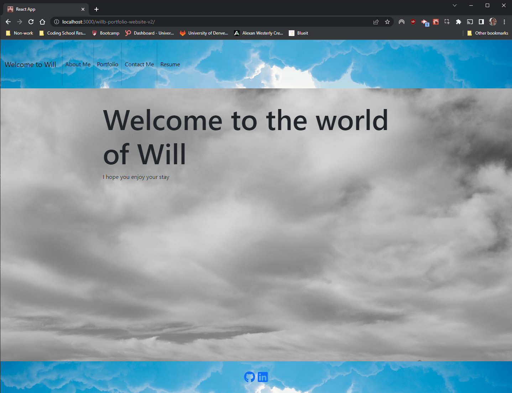

# WillB Portfolio Website v2

## Table of Contents

- [Description](#description)
- [Questions](#questions)
- [License](#license)

## Description

This is the second version of my portfolio website, written using react to make it much more modern and responsive. While it is certainly not the final version of the site, it is a great improvement and modernization of the first site.

## Questions

You can contact me with questions in the following places: 

Github Profile: https://github.com/TrueWillB 

## A Note:

This website was designed under a very tight deadline with a lot of overhead work. This does not represent the final form of this site, but simply the form that is ready to turn in for my bootcamp class

## License

This repo and all of its contents operate under MIT License. For details, please view the LICENSE file in the repository or click the badge: 
